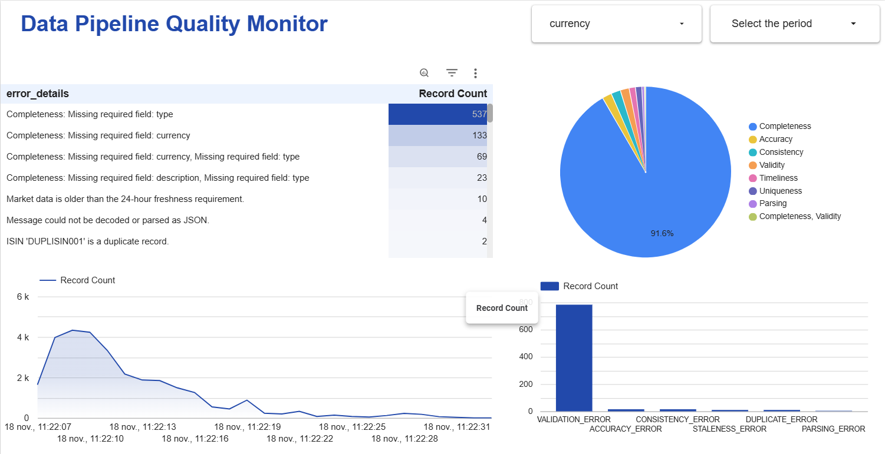

# Data Quality Monitoring Pipeline for Financial Data

This project implements an end-to-end data quality monitoring pipeline on Google Cloud Platform (GCP). It is designed to ingest financial symbol data, validate it against a set of data quality rules in real-time, and route valid and invalid records to separate BigQuery tables for analysis and dashboarding.



## Architecture

The pipeline follows a streaming architecture using managed GCP services:

1.  **Publisher (`Cloud Run`)**: A containerized Python service polls an external API (e.g., Finnhub) for data. It then publishes each data record as a message to a GCP Pub/Sub topic.
2.  **Messaging (`Pub/Sub`)**: A Pub/Sub topic acts as a durable, scalable buffer for the raw data messages, decoupling the publisher from the processing pipeline.
3.  **Transformation & Validation (`Dataflow`)**: A streaming Apache Beam pipeline, deployed as a Dataflow Flex Template, subscribes to the Pub/Sub topic. It performs data quality checks on each record.
    *   **Valid Records**: Are written to a primary BigQuery table (`symbols`).
    *   **Invalid Records**: Are written to a separate failures table (`symbols_failures`), enriched with metadata about the specific DQ error (e.g., error type, dimension).
4.  **Storage & Analysis (`BigQuery`)**: The two BigQuery tables serve as the data warehouse. The `symbols_failures` table is the primary source for building a data quality dashboard (e.g., in Looker Studio).
5.  **Infrastructure (`Terraform`)**: All underlying GCP resources (Pub/Sub topics, BigQuery tables, IAM roles, etc.) are managed declaratively using Terraform.

## Project Structure

```
.
├── dataflow/         # Apache Beam pipeline for DQ validation
├── publisher/        # Data publishing service (for Cloud Run)
└── terraform/        # GCP infrastructure definitions
```

## Setup and Deployment

### Prerequisites

*   Google Cloud SDK (`gcloud`) installed and authenticated.
*   Terraform installed.
*   A GCP project with the required APIs enabled: Artifact Registry, Cloud Build, Cloud Run, Dataflow, and BigQuery.

### Step 1: Deploy Infrastructure

Navigate to the Terraform directory to initialize and apply the configuration. This will create the necessary GCP resources. Replace the variables with your own values.

```bash
cd terraform
terraform init
terraform apply -var="gcp_project_id=[YOUR_GCP_PROJECT_ID]" -var="finnhub_api_key=[YOUR_FINNHUB_API_KEY]"
cd ..
```

### Step 2: Build and Deploy the Publisher Service

These commands build the publisher's Docker image, push it to GCP Artifact Registry, and deploy it as a Cloud Run service.

```bash
# Variables
GCP_PROJECT_ID="[YOUR_GCP_PROJECT_ID]"
REGION="[YOUR_GCP_REGION]" # e.g., us-central1
ARTIFACT_REPO_NAME="pipeline-images"
SERVICE_ACCOUNT_EMAIL="publisher-sa@${GCP_PROJECT_ID}.iam.gserviceaccount.com"

# Enable Artifact Registry API
gcloud services enable artifactregistry.googleapis.com

# Create the container repository (only needs to be done once)
gcloud artifacts repositories create $ARTIFACT_REPO_NAME --repository-format=docker --location=$REGION

# Build and submit the container image
gcloud builds submit ./publisher --tag "${REGION}-docker.pkg.dev/${GCP_PROJECT_ID}/${ARTIFACT_REPO_NAME}/finnhub-publisher:latest"

# Deploy to Cloud Run
gcloud run deploy finnhub-publisher \
  --image "${REGION}-docker.pkg.dev/${GCP_PROJECT_ID}/${ARTIFACT_REPO_NAME}/finnhub-publisher:latest" \
  --platform managed \
  --region $REGION \
  --service-account $SERVICE_ACCOUNT_EMAIL \
  --set-env-vars="GCP_PROJECT_ID=${GCP_PROJECT_ID}" \
  --set-env-vars="PUBLISH_TOPIC_ID=finnhub-stream" \
  --set-env-vars="FINNHUB_API_KEY=[YOUR_FINNHUB_API_KEY]" \
  --allow-unauthenticated
```

### Step 3: Build and Run the Dataflow Job

These commands build a Dataflow Flex Template, which allows the pipeline to be run on demand without re-staging the code.

```bash
# Variables
GCP_PROJECT_ID="[YOUR_GCP_PROJECT_ID]"
REGION="[YOUR_GCP_REGION]" # e.g., us-central1
GCS_BUCKET="[YOUR_GCS_BUCKET_FOR_TEMPLATES]" # e.g., gs://my-dataflow-templates
ARTIFACT_REPO_NAME="pipeline-images"
SERVICE_ACCOUNT_EMAIL="transformer-sa@${GCP_PROJECT_ID}.iam.gserviceaccount.com"

# Build the Flex Template image and definition file
gcloud dataflow flex-template build "${GCS_BUCKET}/templates/finnhub-symbol-transformer" \
  --image-gcr-path "${REGION}-docker.pkg.dev/${GCP_PROJECT_ID}/${ARTIFACT_REPO_NAME}/dataflow/finnhub-symbol-transformer:latest" \
  --sdk-language "PYTHON" \
  --metadata-file "metadata.json" \
  --py-path "." \
  --env FLEX_TEMPLATE_PYTHON_REQUIREMENTS_FILE=dataflow/requirements.txt \
  --env FLEX_TEMPLATE_PYTHON_PY_FILE=dataflow/transform.py

# Run the Dataflow job from the template
gcloud dataflow flex-template run "finnhub-symbol-dq-$(date +%Y%m%d-%H%M%S)" \
  --template-file-gcs-location "${GCS_BUCKET}/templates/finnhub-symbol-transformer" \
  --region $REGION \
  --service-account-email $SERVICE_ACCOUNT_EMAIL \
  --parameters "input_subscription=projects/${GCP_PROJECT_ID}/subscriptions/finnhub-stream-sub-dataflow" \
  --parameters "output_table=${GCP_PROJECT_ID}:finnhub_data.symbols" \
  --parameters "failure_table=${GCP_PROJECT_ID}:finnhub_data.symbols_failures"
```

